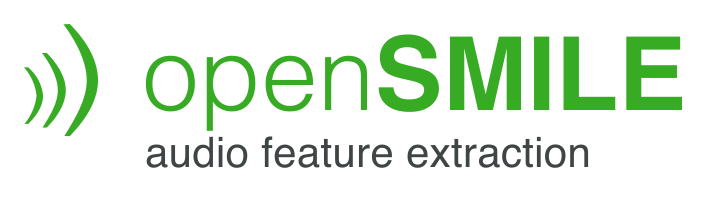

**openSMILE** (**open**-source **S**peech and **M**usic **I**nterpretation by **L**arge-space **E**xtraction)
is a complete and open-source toolkit for audio analysis, 
processing and classification especially targeted at speech and 
music applications, e.g. automatic speech recognition, speaker identification,
emotion recognition, or beat tracking and chord detection.

It is written purely in C++, has a fast, efficient, and flexible architecture, 
and runs on desktop, mobile, and embedded platforms such as Linux, Windows, macOS, Android, iOS
and Raspberry Pi.

See also the standalone
[opensmile](https://github.com/audeering/opensmile-python) Python package
for an easy-to-use wrapper if you are working in Python.

What's new
----------

Please see our [blog post](https://www.audeering.com/introducing-opensmile-3-0/) on audeering.com for a summary of the new features in version 3.0.

Quick start
-----------

Pre-built x64 binaries for Windows, Linux, and macOS are provided on the [Releases](https://github.com/audeering/opensmile/releases) page. Alternatively, you may follow the steps below to build openSMILE yourself, if desired.

For more details on how to customize builds, build for other platforms, and use
openSMILE, see Section [Get started](https://audeering.github.io/opensmile/get-started.html)
in the documentation.

### Linux/MacOS

Prerequisites:
- A version of gcc and g++ or Clang needs to be installed that supports C++11.
- CMake 3.5.1 or later needs to be installed and in the PATH.

1. In ``build_flags.sh``, set build flags and options as desired.
2. Run ``bash build.sh``.

Build files will be generated in the ``./build`` subdirectory.
You can find the main SMILExtract binary in ``./build/progsrc/smilextract``.

### Windows

Prerequisites:
- Visual Studio 2017 or higher with C++ components is required.
- CMake 3.15 or later needs to be installed and in the PATH.

1. In ``build_flags.ps1``, set build flags and options as desired.
2. Run ``powershell -ExecutionPolicy Bypass -File build.ps1``.

Build files will be generated in the ``./build`` subdirectory.
You can find the main SMILExtract.exe binary in ``./build/progsrc/smilextract``.

Documentation
-------------

You can find extensive documentation with step-by-step instructions on how to build 
openSMILE and get started at https://audeering.github.io/opensmile/.

History
-------

The toolkit was first developed at the Institute for Human-Machine 
Communication at the Technische Universität München in Munich, Germany.
It was started within the SEMAINE EU-FP7 research project.
The toolkit is now owned and maintained 
by [audEERING GmbH](https://audeering.com), who provide intelligent
audio analysis solutions, automatic speech emotion recognition,
and paralinguistic speech analysis software packages as well as
consulting and development services on these topics.

Contributing and Support
------------------------

We welcome contributions! For feedback and technical support, 
please use the [issue tracker](https://github.com/audeering/opensmile/issues).

Licensing
---------

openSMILE follows a dual-licensing model. Since the main goal of the project 
is widespread use of the software to facilitate research in the field of 
machine learning from audio-visual signals, the source code, and binaries are 
freely available for private, research, and educational use under an open-source license
(see [LICENSE](LICENSE)).
It is not allowed to use the open-source version of openSMILE for any sort of commercial product.
Fundamental research in companies, for example, is permitted, but if a product is the result of 
the research, we require you to buy a commercial development license. 
Contact us at info@audeering.com (or visit us at https://www.audeering.com) for more information.

Original authors: Florian Eyben, Felix Weninger, Martin Wöllmer, Björn Schuller  
Copyright © 2008-2013, Institute for Human-Machine Communication, Technische Universität München, Germany  
Copyright © 2013-2015, audEERING UG (haftungsbeschränkt)  
Copyright © 2016-2023, audEERING GmbH

Citing
------

Please cite openSMILE in your publications by citing the following paper:

> Florian Eyben, Martin Wöllmer, Björn Schuller: "openSMILE - The Munich Versatile and Fast Open-Source Audio Feature Extractor", Proc. ACM Multimedia (MM), ACM, Florence, Italy, ISBN 978-1-60558-933-6, pp. 1459-1462, 25.-29.10.2010.
